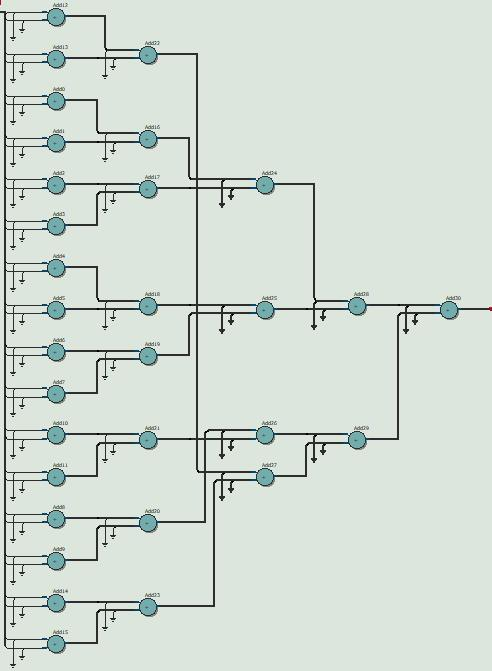
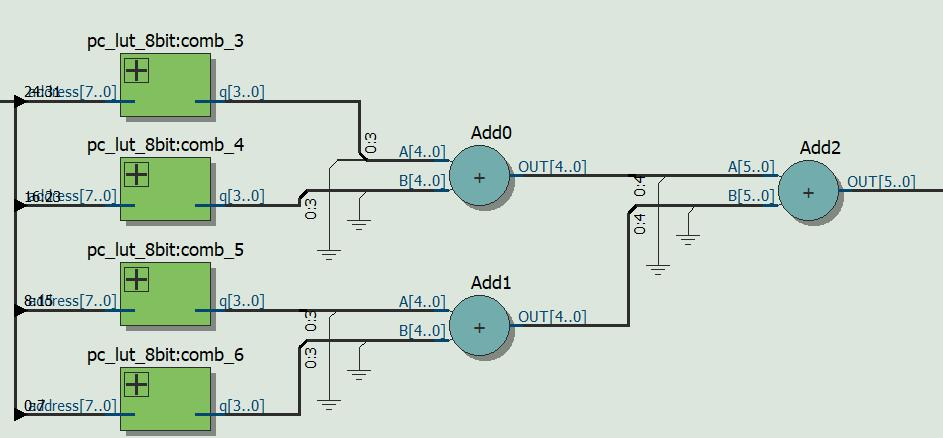

# Pop Countの比較

## Method 1
### 説明
パラレルに１を足していく方法。log(n)段のadderが使われる。

### 結果
|name|value|
|:-:|:-:|
|Fmax|188.82MHz|
|data delay|5.552ns|

### RTL

### file
- [pop_count_no_scheme.v](pop_count_no_scheme.v)
- [pop_count_no_scheme_tb.v](pop_count_no_scheme_tb.v)

## Method 2
### 説明
8bitでLUTを使い、その合計値を求める。

### 結果
|name|value|
|:-:|:-:|
|Fmax|186.64MHz|
|data delay|5.686ns|

### RTL

### file
- [pop_count_lut8.v](pop_count_lut8.v)
- [pop_count_lut8_tb.v](pop_count_lut8_tb.v)
